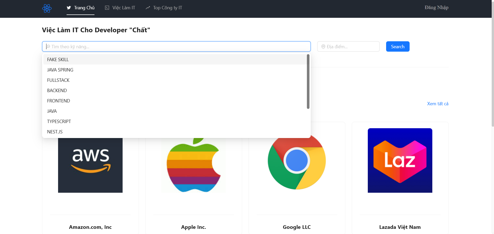
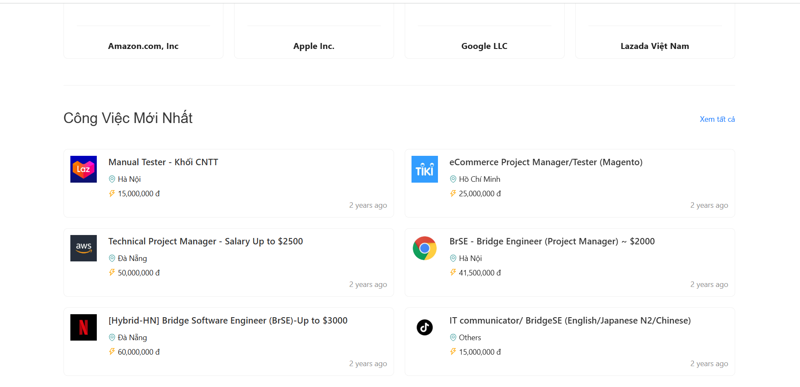
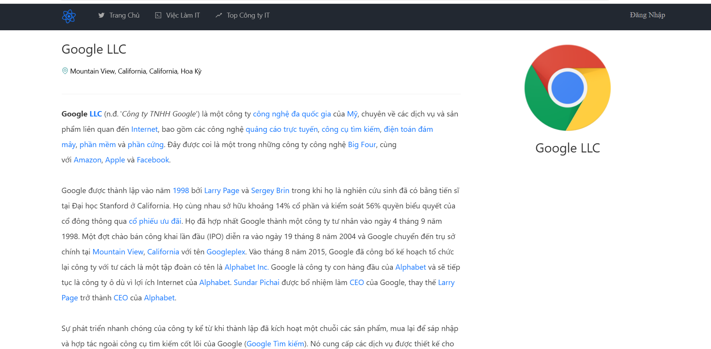
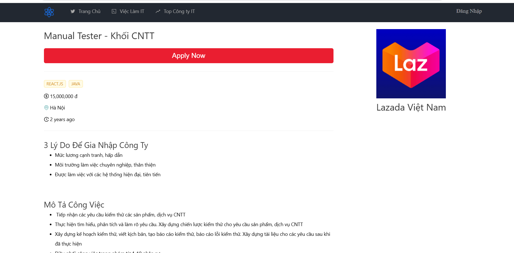
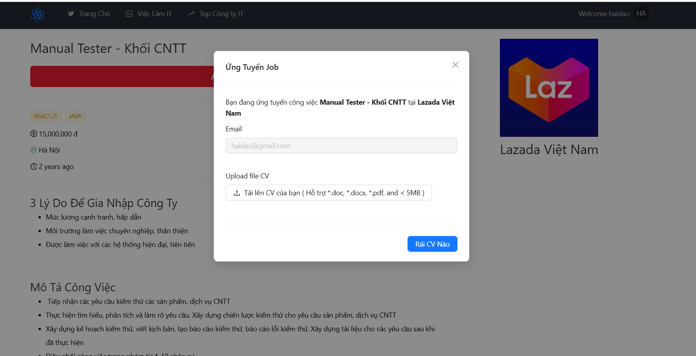
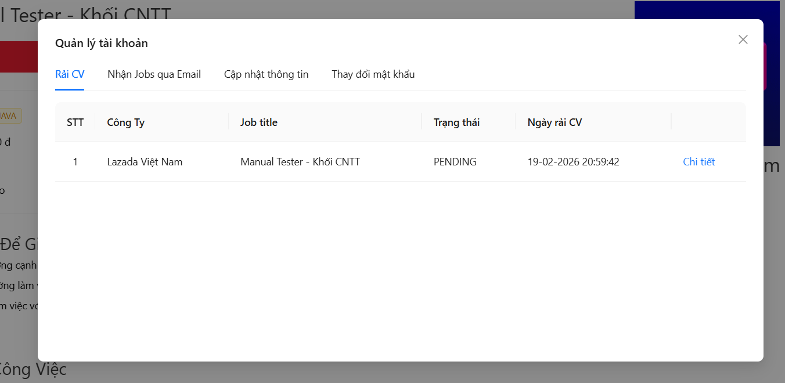
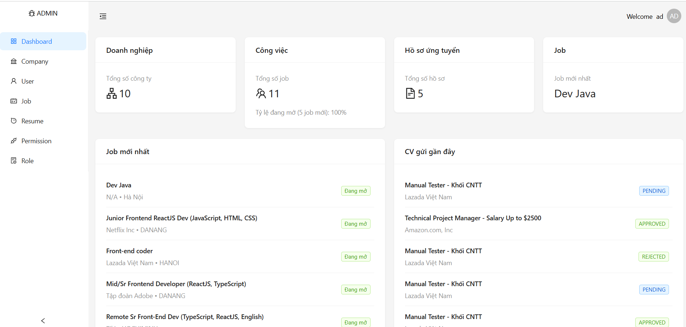
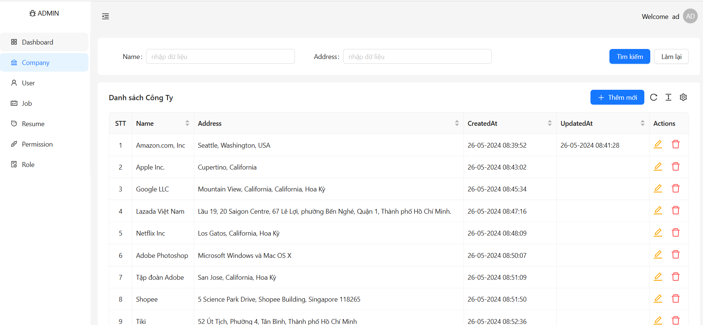
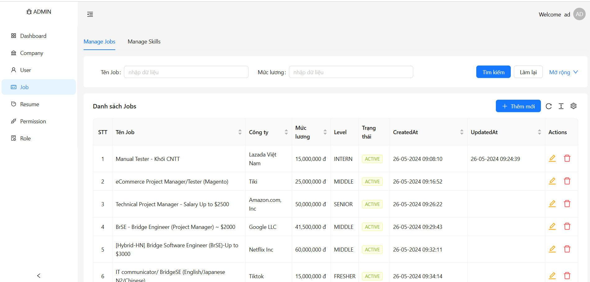
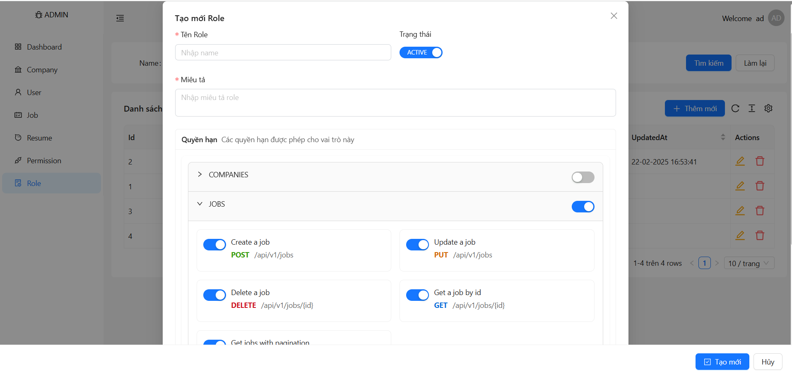

## Prerequisite
- Cài đặt JDK 17+ nếu chưa thì [cài đặt JDK](https://tayjava.vn/cai-dat-jdk-tren-macos-window-linux-ubuntu/)
- Install Maven 3.5+ nếu chưa thì [cài đặt Maven](https://tayjava.vn/cai-dat-maven-tren-macos-window-linux-ubuntu/)
- Install IntelliJ nếu chưa thì [cài đặt IntelliJ](https://tayjava.vn/cai-dat-intellij-tren-macos-va-window/)

## Technical Stacks
- Java 17
- Spring Boot 3.2.3
- MySQL
- Kafka
- Maven 3.5+
- Lombok
- DevTools
- Docker, Docker compose

## Giao diện người dùng

Giao diện trang chủ:

Giao diện trang chi tiết công ty:

Giao diện trang chi tiết công việc:

Giao diện ứng tuyển công việc:

Giao diện quản lý tài khoản:

Giao diện Admin:

Giao diện quản lý công ty:

Giao diện quản lý công việc:

Giao diện quản lý quyền hạn:
